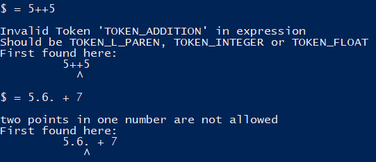
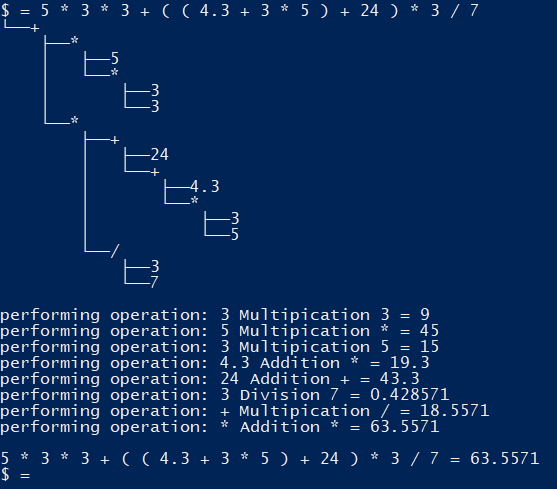

# Parser for Mathematical Expressions
A simple console based calculator

## Why?
I was annoyed because everytime I wanted to use a good calculator, the easiest option was to start a Python interpretor.
So I thought: "Why not make my own version that will definitely be not as good".
That then spiraled into me making my first own CMake project.

## What does it do?
It calculates stuff.

That's it, it's a calculator.

At the moment it supports addition, subtraction, multiplication, division, parenthesis, and integer and floating point numbers.

Future support for fractions, exponents as well as literals and different language modes are planned.

## How do I use it?
If you are on Windows you can just download the .exe from the latest release.

If you are on any other operating system you'll have to wait until the libc++/libstdc++ properly support the \<format> header.

There are also more output modes accessible through the -v (--verbose) and -d (--debug) flags.
Verbose just means more detailed error messages, the debug flag displays how the calculation is performed.

## How does it work?
To make it short, it constructs a binary tree from a given input string.
The leaves are all the numbers and the operations connect them together, the depth determines the priority of operations (PEMDAS/"Punktrechnung vor Strichrechnung").

For example, if you take a long expression like 5 * 3 * 3 + ( ( 4.3 + 3 * 5 ) + 24 ) * 3 / 7, the generated tree will look like this:

For more details I recommend going through the source files, all Interface methods have comments explaining their behaviour.

## What can I do for you?
If you have suggestions for new features feel free to tell me.
