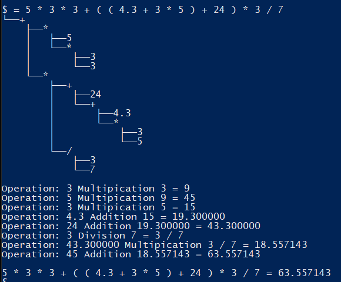

# Parser for Mathematical Expressions
A simple console based calculator

## Why?
I was annoyed because everytime I wanted to use a good calculator, the easiest option was to start a Python interpretor.
So I thought: "Why not make my own version that will definitely be not as good".
That then spiraled into me making my first own CMake project.

## What does it do?
It calculates stuff.

That's it, it's a calculator.

At the moment it supports addition, subtraction, multiplication, division, exponentiation, parenthesis, and integer and floating point numbers (both signed and unsigned).

## How do I use it?
If you are on Windows you can just download the .exe from the latest release.

If you are on any other operating system you'll have to wait until the libc++/libstdc++ properly support the \<format> header.

There are also more output modes accessible through the -v (--verbose), -d (--debug), and -ger flags.
Verbose just means more detailed error messages, the debug flag displays how the calculation is performed, and the ger flag sets the locale to German (if you want floats seperated by a ',').

## How does it work?
To make it short, it constructs a binary tree from a given input string.
The leaves are all the numbers and the operations connect them together, the depth determines the priority of operations (PEMDAS/"Punktrechnung vor Strichrechnung").

For example, if you take a long expression like `5 * 3 * 3 + ( ( 4.3 + 3 * 5 ) + 24 ) * 3 / 7`, the generated tree will look like this:

For more details I recommend going through the source files, all Interface methods have comments explaining their behaviour.

## Does it have known quirks?
Of course! A lot of them intended:
 - Both `x.` and `.x` are valid numbers
 - You do not have to open or close parenthesis, they will be treated as if the opening/closing parenthesis are at the beginning/end of the expression
 - The last operation does not need a right-hand number, that number will be assumed to be 0 (e.g. `2 * 5 +` will be treated as `2 * 5 + 0`)
 - If a two integers are not cleanly divisible, that operation will result in a fraction
 - Floating point numbers are viral, if there is one in the expression, the entire expression will yield a float[^1]

[^1]: If you exponentiate a number with `0` or `0.0`, regardless of type, it will result in an integer (`1`)

(if you find more please tell me, I'll decide if it's a bug or intended :))
## How can I help this project?
If you have suggestions for new features feel free to tell me.
